# Enterprise Identity & Access Management (IAM) Sandbox Lab

## The Problem This Portfolio Solves

Every organization that runs cloud infrastructure faces a version of the same identity crisis: too many people have too much access, for too long, with too little oversight. A new hire gets onboarded and someone forgets to remove their contractor-level permissions. An admin account sits permanently elevated at Global Administrator even when nobody is actively using it. A Finance analyst who moved to a different department three years ago still has read access to payroll data. An AI agent spun up for a customer support pilot has no defined owner, no access boundary, and no monitoring.

None of these are edge cases. They are the daily reality of enterprise identity management, and they are how breaches happen — not through sophisticated zero-day exploits, but through accumulated, unreviewed, ungoverned access that attackers find and exploit.

This lab portfolio was built to demonstrate the ability to architect, implement, and operate the controls that eliminate these vulnerabilities: automated lifecycle management, just-in-time privilege elevation, self-remediating access certification, federated identity governance across platforms, and AI workload identity containment.

## Why These Tools

**Microsoft Entra ID over alternatives:** Entra ID is the dominant enterprise cloud identity platform, present in the majority of Fortune 500 environments and deeply integrated across the Microsoft 365 and Azure ecosystem. For organizations running hybrid or cloud-first infrastructure, it is not a choice between Entra ID and something else — it is the operating environment. Demonstrating fluency in Entra ID specifically (not generic IAM concepts) maps directly to what hiring managers need on day one.

**Okta for federation:** Okta holds significant market share in enterprise SaaS identity, particularly in organizations that run multi-cloud or non-Microsoft-primary stacks. Configuring SAML federation between Entra ID as the Identity Provider and Okta as the Service Provider demonstrates cross-platform interoperability — the ability to govern identity across organizational and technology boundaries, not just within a single vendor's ecosystem.

**PIM over permanent role assignment:** Privileged Identity Management solves a specific failure mode that RBAC alone cannot: standing access. An account permanently assigned Global Administrator is a 24/7 attack surface. PIM converts that to a just-in-time model where elevated access must be actively requested, approved, MFA-verified, and time-bounded — reducing the window of exposure from permanent to hours.

**Entitlement Management over manual provisioning:** Manual group membership management does not scale and does not audit. Entitlement Management packages resources into governed, requestable bundles with approval workflows and automatic expiration, replacing a process that relies on humans remembering to clean up with one that enforces cleanup automatically.

**Agent ID for AI workloads:** As organizations deploy autonomous AI agents, those agents need identity governance the same way human users do. Microsoft Entra Agent ID (generally available 2026) extends Zero Trust principles to non-human workloads — allowing organizations to define what an agent can access, who is accountable for it, and what happens when its behavior becomes anomalous. Governing AI agents is not a future concern; it is a current one for any organization running Copilot, custom agents, or automated workflows.

---

## 1. Executive Summary

This project details the design, implementation, and management of an enterprise-grade Identity and Access Management (IAM) sandbox built within Microsoft Entra ID. Built using Zero Trust-aligned identity controls, this lab simulates the entire employee Joiner-Mover-Leaver (JML) lifecycle.

The core objective of this project was to engineer automated access controls, enforce high-security authentication perimeters, proactively remediate privilege creep during role transitions, and implement forensic auditing and disaster recovery fail-safes. The architecture demonstrates practical enforcement of the Principle of Least Privilege (PoLP) and robust identity governance.

## 2. Environment Architecture

- **Identity Provider (IdP):** Microsoft Entra ID (Formerly Azure Active Directory), Entra ID P2 tier
- **Security Framework:** Zero Trust-aligned Access Model
- **Authentication Controls:** Conditional Access Policies, Mandatory Multi-Factor Authentication (MFA)
- **Governance Mechanisms:** Dynamic Group Memberships, Entitlement Management (Access Packages, Resource Catalogs), Role-Based Access Control (RBAC), Privileged Identity Management (PIM) eligible role assignments
- **Monitoring & Telemetry:** Azure Log Analytics Workspace, KQL (Kusto Query Language) queries against SignInLogs and AuditLogs

## 3. Technologies & Tools

Microsoft Entra ID P2, Azure Portal, Azure Log Analytics, Conditional Access Policy Engine, KQL (Kusto Query Language), RBAC, Dynamic Group Membership Rules, Entra Role Assignments, Privileged Identity Management (PIM), Entitlement Management, Access Packages, Okta Identity Engine, SAML 2.0, Just-In-Time (JIT) Provisioning, Okta Profile Editor, Okta System Log, Microsoft Entra Agent ID, Agent Blueprints, Agent Identities, Conditional Access for Agents, Agent Risk (Preview), Risky Agents Dashboard

## 4. Lab 1: Identity Governance & Lifecycle Management

### Phase 1: Enterprise Identity Directory

**Business Problem:** A new organization requires a structured identity directory that accurately reflects real-world departmental diversity, including standard employees, contractors, executives, and non-human service identities.

**Solution:** Built an 11-user directory populated with realistic metadata (job titles, departments, usage location, employee type) covering Finance, IT, Sales, Engineering, Executive, Contractor, and AI Workload archetypes.

**Evidence:** User directory screenshots showing full metadata population across all account types.
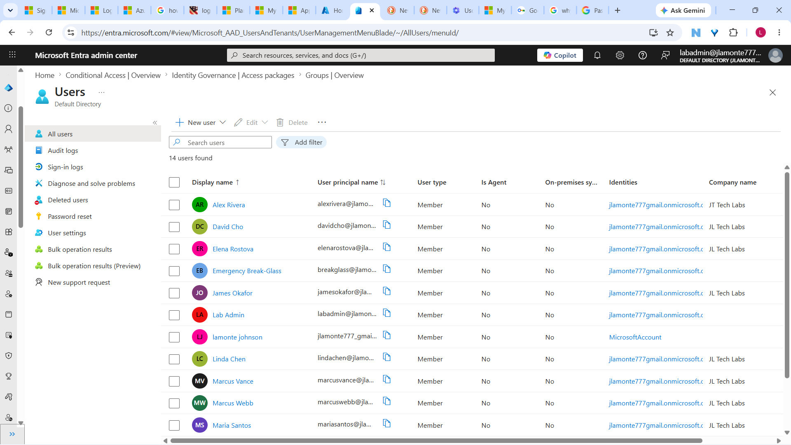
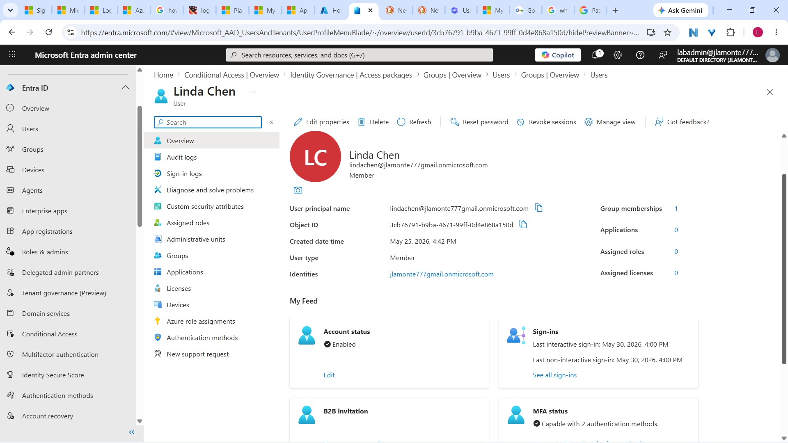

### Phase 2: Security Group Architecture

**Business Problem:** Flat directories with no logical grouping make policy enforcement and access management unmanageable at scale.

**Solution:** Created 4 assigned security groups (GRP-Finance-HighSecurity, GRP-Remote-Workers, GRP-IT-Admins, GRP-Contractors-External) to logically segment users by function and risk profile, enabling targeted policy application.

**Evidence:** Group membership screenshots showing correct segmentation.
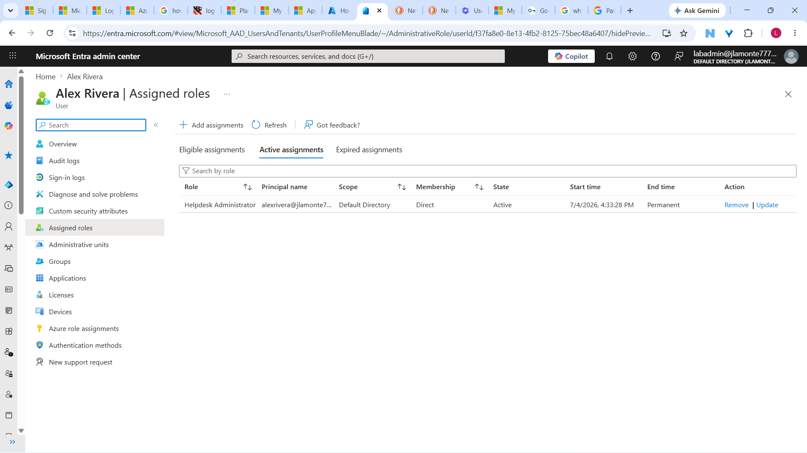
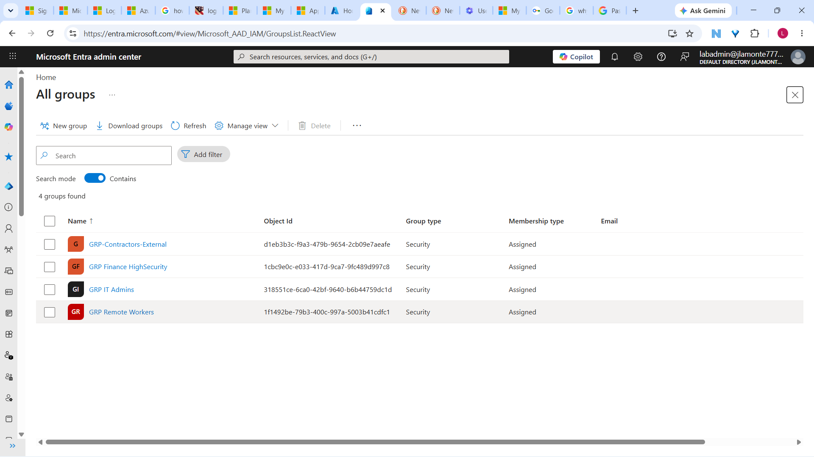
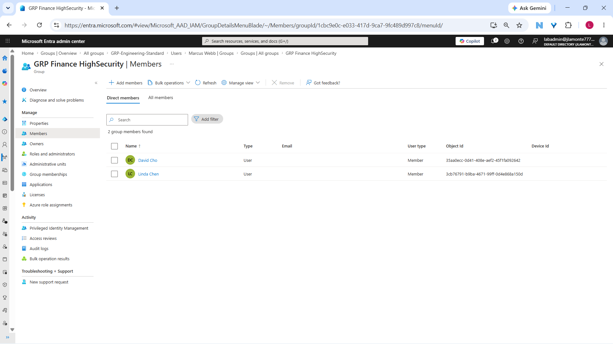

### Phase 3: Dynamic Group Automation

**Business Problem:** Manually managing group membership for every employee does not scale and introduces human error and delay.

**Solution:** Deployed a dynamic membership group (GRP-All-Internal-Employees) using Entra ID P2 automation rules, enabling self-populating group membership based on user attributes with zero manual intervention.

**Evidence:** Screenshot of dynamic group auto-populating 12 members immediately following rule deployment.
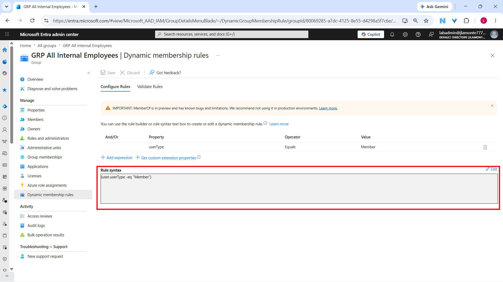
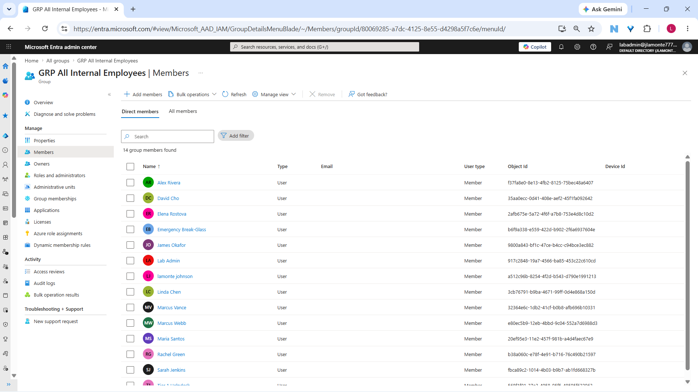

### Phase 4: Zero Trust Conditional Access & MFA Enforcement

**Business Problem:** High-risk user populations (Finance) require stronger authentication assurance than standard employees, without creating blanket friction for the entire organization.

**Solution:** Deployed POL-Enforce-MFA-HighSecurity, a Conditional Access Policy targeting GRP-Finance-HighSecurity, requiring Multi-Factor Authentication for sign-in. Included a deliberate exclusion for the administrative break-glass account to prevent lockout scenarios.

**Evidence:** Live MFA challenge screens triggered during test logins for David Cho and Linda Chen, confirming policy enforcement in the lab tenant.
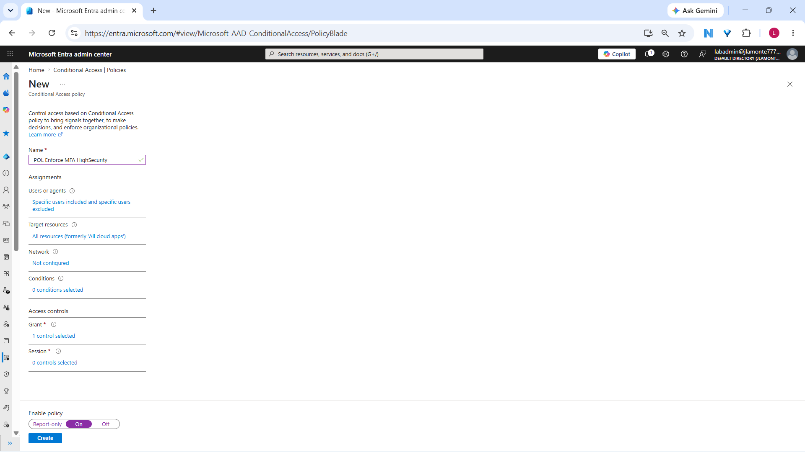
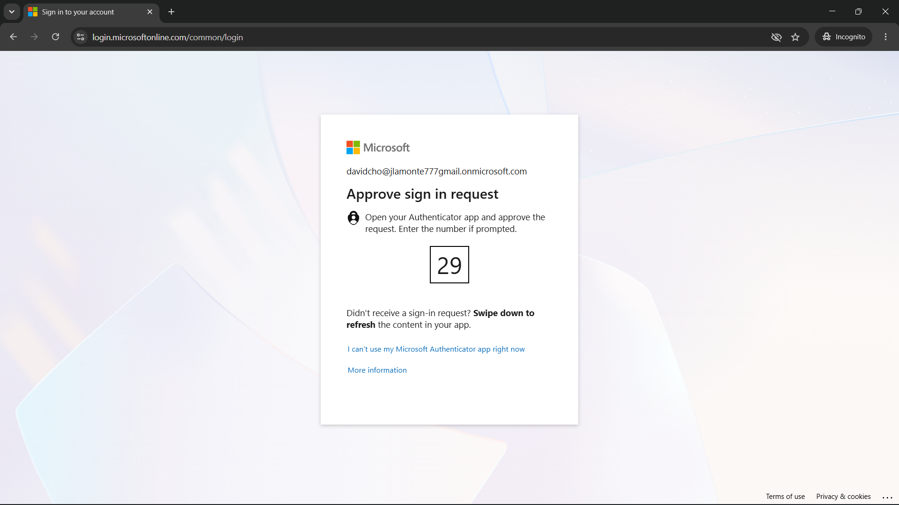

**Key Technical Finding:** Testing showed that Microsoft-managed tenant security protections and admin portal authentication requirements can still trigger MFA behavior outside the scope of a custom Conditional Access exclusion. This shaped the break-glass design toward phishing-resistant, non-human-controlled FIDO2 hardware authentication as the more robust long-term approach.

### Phase 5: Helpdesk Delegation & Role-Based Access Control

**Business Problem:** Global Administrator accounts should never be used for routine tasks like password resets, as this creates unnecessary exposure of high-privilege credentials.

**Solution:** Created a Tier 1 Helpdesk identity and assigned the built-in Helpdesk Administrator role, scoped specifically to perform password resets without visibility into Conditional Access or security configuration.

**Evidence:** Verified the helpdesk account successfully reset a standard user's password while receiving an explicit "Access Denied" response when attempting to view or modify Conditional Access Policies, confirming least-privilege boundary enforcement on both sides.
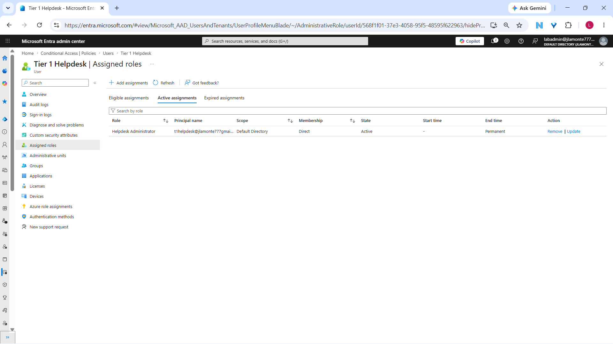
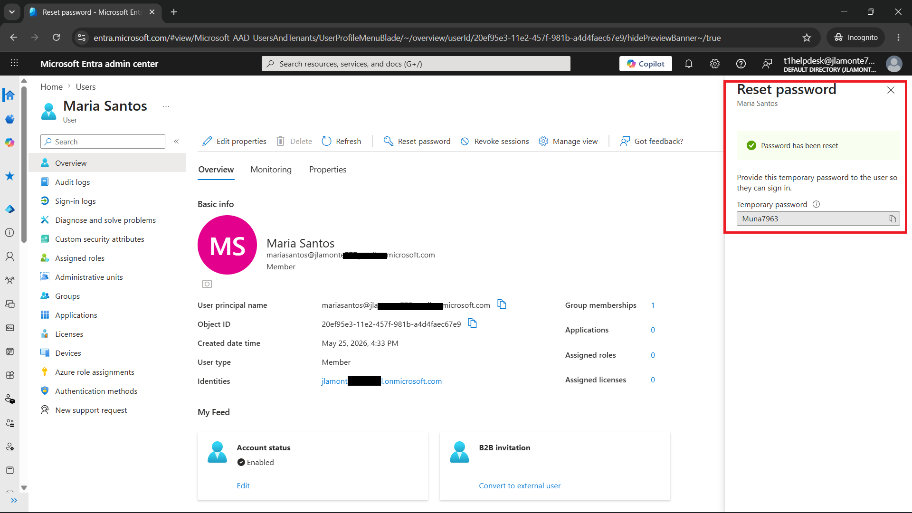
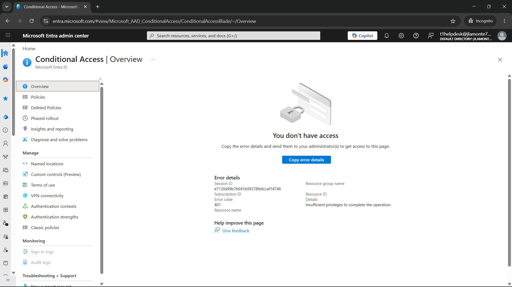

### Phase 6: Joiner-Mover-Leaver (JML) Lifecycle

**Joiner — Business Scenario:** A new hire (Marcus Webb, Junior Developer) requires baseline access provisioned automatically with zero pre-existing or inherited permissions.

**Engineering Execution:** Verified automatic enrollment into the dynamic baseline group (GRP-All-Internal-Employees) at account creation. Manually provisioned department-specific access via a newly created GRP-Engineering-Standard assigned group, demonstrating deliberate, auditable access decisions for departmental resources.

**Evidence:** Confirmed Marcus's clean-slate group membership prior to department assignment, and successful provisioning into the Engineering group.

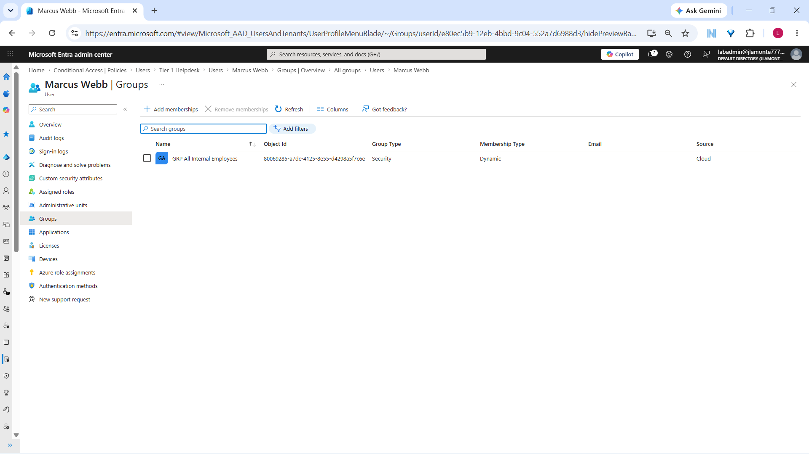


**Mover — Business Scenario:** Marcus Webb receives an internal promotion to IT Security Analyst, requiring an access transition that eliminates lingering Engineering permissions (privilege creep) while granting appropriate IT Security access.

**Engineering Execution:** Updated core identity attributes (job title, department) to reflect the new role. Manually removed Marcus from GRP-Engineering-Standard and added him to GRP-IT-Admins, ensuring no residual access followed him into his new position.

**Evidence:** Verified final group membership reflected only GRP-All-Internal-Employees and GRP-IT-Admins, with Engineering access fully revoked.
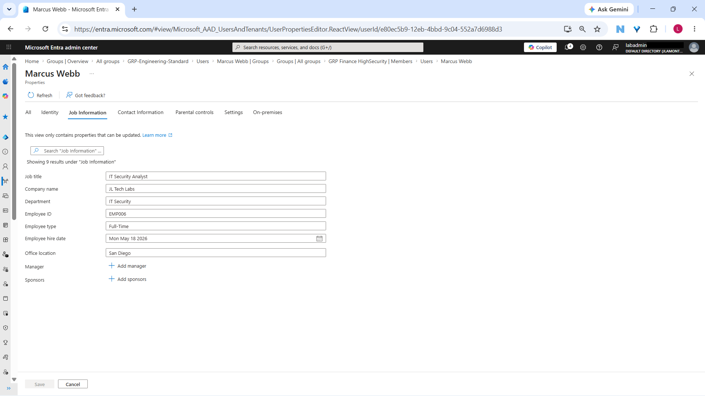
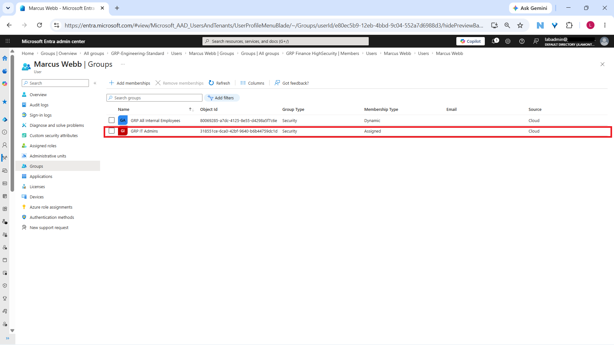

**Leaver — Business Scenario:** Marcus Webb is terminated from the organization. To mitigate insider threat risk, IT must immediately neutralize the identity.

**Engineering Execution:** Executed a high-priority, multi-step offboarding sequence prioritized for speed-to-neutralization: (1) Account disabled to block new authentication attempts, (2) Active session tokens globally revoked to terminate any lingering browser connections, (3) Manual group memberships removed, while dynamic group membership was left to auto-remediate via directory synchronization.

**Defensive Verification:** Simulated a post-termination login attempt via incognito browser. The perimeter successfully blocked access, returning error code 50057 ("the user account is disabled").

**Forensic Evidence:** Confirmed the administrative transition via Entra ID Audit Logs, capturing the AccountEnabled property change from true to false as an immutable record.

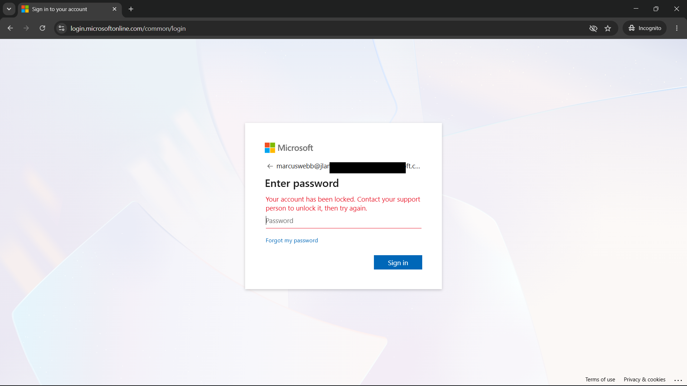

### Phase 7: Forensic Auditing

**Business Problem:** Security controls are only as credible as the evidence that proves they functioned correctly. Auditors and incident responders require a verifiable trail of administrative actions.

**Solution:** Reviewed Entra ID Audit Logs to trace the complete history of Marcus Webb's lifecycle, from account creation through role transition to termination, confirming each administrative action was logged immutably with timestamp and actor attribution.

**Evidence:** Audit log entries corresponding to each lifecycle event.
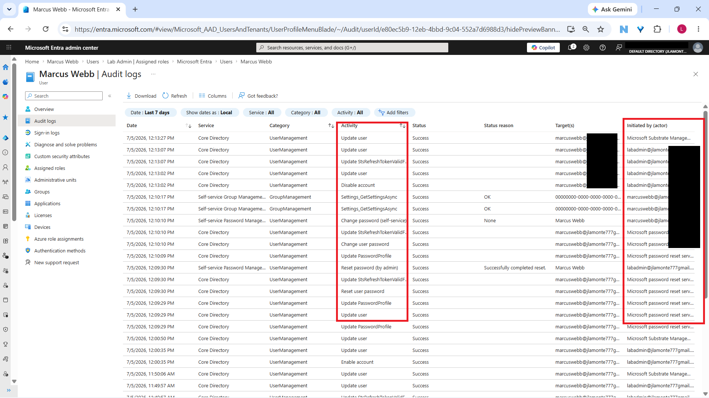

### Phase 8: Emergency Access (Break-Glass Account) & SIEM Telemetry

**Business Problem:** Maintaining uninterrupted access to the root tenant during a catastrophic event, such as a widespread MFA provider outage or identity synchronization failure, is critical for disaster recovery. Standard administrative accounts may become unavailable during exactly the scenarios where emergency access is needed most.

**Solution:** Created a dedicated, cloud-only emergency administrative identity (Emergency Break-Glass) using an intentional naming convention isolated from standard user patterns, on the tenant's default domain. Assigned permanent (non-JIT) Global Administrator privileges, since Privileged Identity Management activation may be unavailable during the exact outage scenarios this account exists to address. Generated a high-entropy password to simulate corporate vaulting procedures. Explicitly excluded the account from the standard Conditional Access MFA policy, with a documented justification for the exclusion.

**SIEM Implementation:** Deployed an Azure Log Analytics workspace (LAW-Enterprise-SIEM) within a dedicated resource group (RG-Security-Logs), and configured Entra ID diagnostic settings to stream SignInLogs and AuditLogs data into it. Authored and executed a KQL tripwire query to isolate all authentication activity tied to the break-glass identity:

```kql
SigninLogs
| where UserPrincipalName == "breakglass@<tenant>.onmicrosoft.com"
| project TimeGenerated, UserPrincipalName, IPAddress, Location, ResultType
| extend Status = case(
    ResultType == 0, "Success",
    ResultType == 50055, "Mandatory Password Reset",
    ResultType == 50140, "Keep Me Signed In Prompt",
    "Other MFA/Auth Challenge"
  )
```

**Evidence:** Verified a baseline of zero events prior to testing, confirming the tripwire's clean state. Triggered a controlled test login and confirmed the query surfaced real authentication telemetry, including AADSTS result codes 0 (Success), 50055 (Mandatory Password Reset), and 50140 (Keep Me Signed In Prompt), each decoded into human-readable status via KQL's `case()` function.
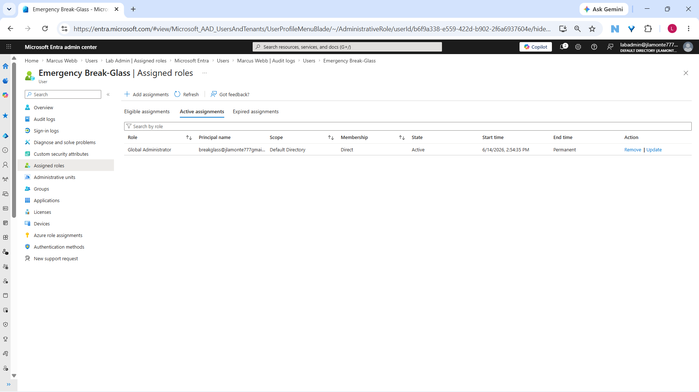
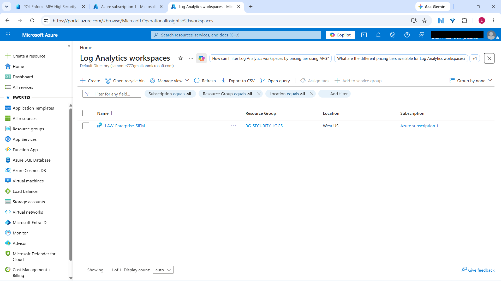
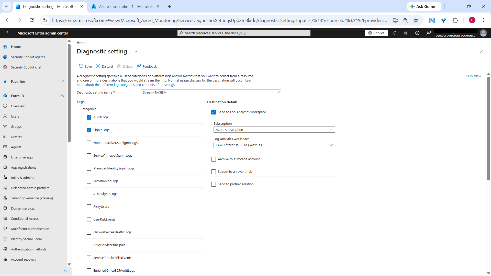
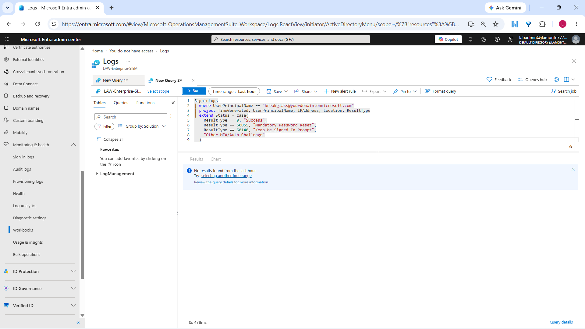
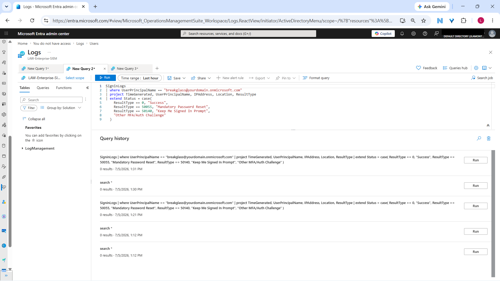

**Key Technical Finding:** While standard security baselines recommend fully excluding break-glass accounts from Conditional Access policies, testing in this lab tenant showed that Microsoft's root-level tenant security defaults can still override these exclusions when accessing administrative endpoints (Azure Portal, Entra Admin Center). Forcing a traditional, human-bound MFA method, such as a personal mobile device, onto an emergency account introduces a single-point-of-failure liability if that employee separates from the organization or loses device access. The more robust approach is binding the identity to a non-human, phishing-resistant FIDO2 hardware security key, with the physical token and its PIN stored in a dual-custody fireproof safe rather than tied to any individual's personal device.

**Infrastructure Lifecycle:** Following successful validation, decommissioned the diagnostic data stream and deleted the associated resource group to prevent unnecessary ongoing data ingestion costs, demonstrating awareness of cloud cost governance.

## 5. Lab 2: Privileged Identity Management (PIM) & Just-In-Time Access

**Project Title:** Enforcing Least Privilege via Just-In-Time (JIT) Role Activation

**Objective:** Eliminate 24/7 permanent administrative privileges on high-value directory accounts to minimize lateral movement risk and credential-theft exposure.

**The Baseline Threat:** The IT Admin persona (Alex Rivera) held standing, permanent Helpdesk Administrator privileges. If this account were compromised, an attacker would inherit immediate, unrestricted control over user profiles and password mechanics with no time limit and no administrative alert triggered.

**The Engineering Defense:** Centralized the role's management within Microsoft Entra Privileged Identity Management (PIM). Migrated the user from a permanent Active assignment to an Eligible assignment, removing standing access entirely.

**Governance Policies Implemented:**
- **Time-Bound Windows:** Capped active privilege lifespan to a strict maximum duration of 8 hours
- **Step-Up Authentication:** Enforced mandatory MFA verification on every activation attempt to mitigate session hijacking or stolen-credential replay
- **Auditability:** Required a mandatory business justification field on every activation request, generating an immutable audit trail for every temporary privilege escalation

**Verification Result:** Logged in as the target user in an isolated incognito session and triggered the PIM activation flow. Successfully cleared all three security gates (MFA, justification, time-bound duration) and confirmed a live, decaying access window with an explicit expiration timestamp, replacing the prior model of unmonitored, always-on administrative access.
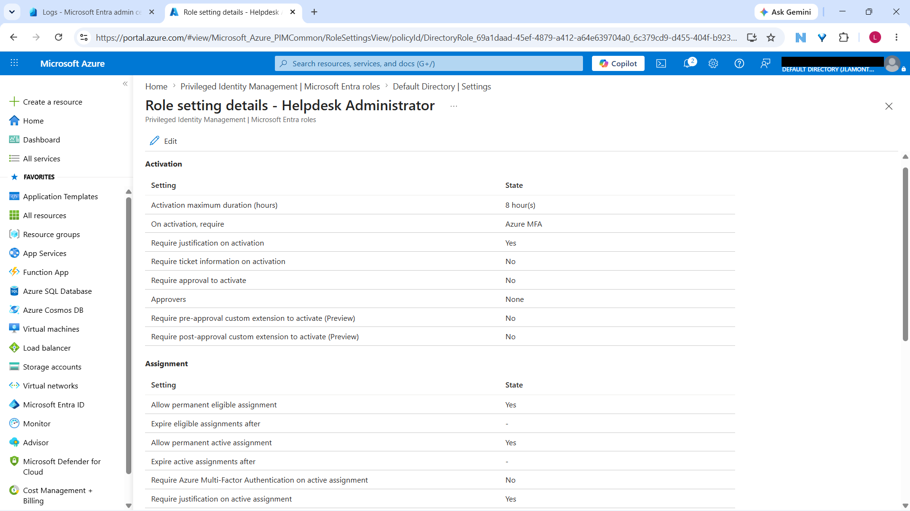
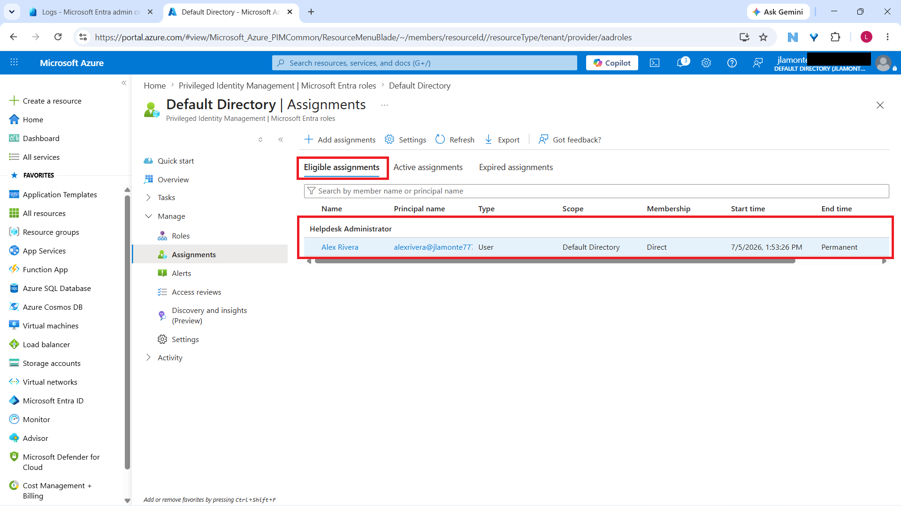
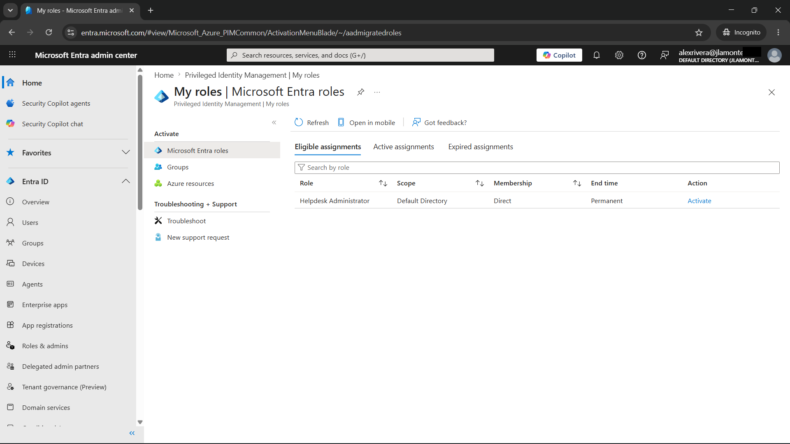


*Note: Alex Rivera serves as a recurring test identity across this lab — the standing administrator account converted to Just-In-Time access in Lab 2, and the test employee used to validate access package provisioning and SSO federation in Lab 3. This reflects deliberate reuse of a single persona across lifecycle stages rather than separate, unrelated accounts.*

## 6. Lab 3: Governance & Cross-Platform Federation

### Lab 3A: Entitlement Management (Internal Governance)

**Business Problem:** Manually assigning new employees to a dozen different groups, sites, and applications one at a time is slow and error-prone. Worse, access granted for a short-term project or onboarding rarely gets cleaned up once the need ends, leading to privilege creep.

**Solution:** Built a self-service governance loop using Microsoft Entra Entitlement Management. Created a Resource Catalog (Marketing Department Resources) containing internal security groups, then bundled them into a single requestable Access Package (Marketing Onboarding Pack) with manager approval and an automatic expiration policy to enforce a strict access shelf-life.

**Evidence:** Verified the access package successfully provisioned group membership to a test user upon assignment.
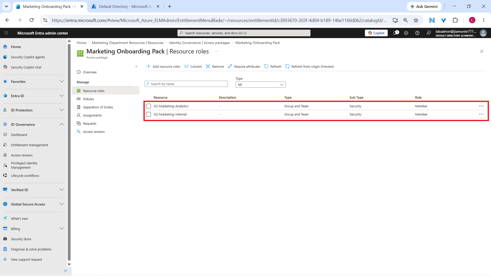

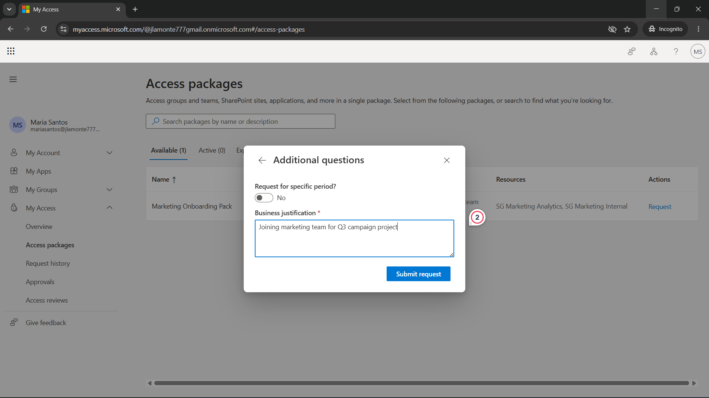
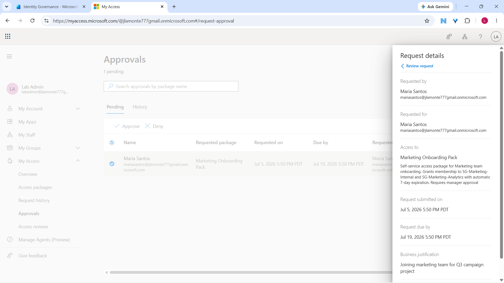
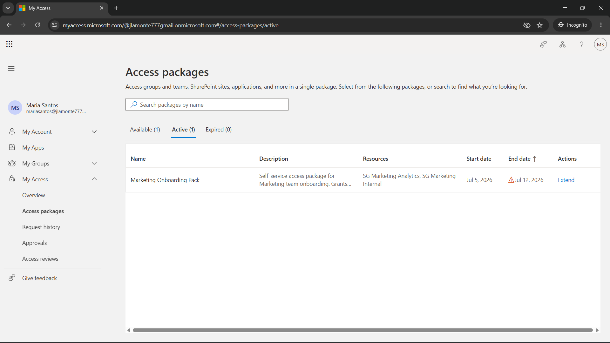

**Key Technical Finding:** During initial testing, the Approvals dashboard failed to surface a pending request, traced to a likely policy state conflict introduced by reassigning the approver mid-configuration combined with a concurrent tenant subscription transition. Bypassed the stuck queue by directly creating the assignment via the Assignments tab to confirm the underlying access package correctly provisioned access, with the full request-approval workflow flagged for re-verification on a subsequent lab rebuild.

### Lab 3B: Cross-Platform SAML Federation (Entra ID → Okta)

**Business Problem:** Enterprises run a mix of platforms — a primary cloud directory alongside third-party SaaS and identity tools. Users need single sign-on into these external services without separate passwords, and that access needs to be governed by the same lifecycle rules as internal resources, not configured as a one-off exception.

**Solution:** Built a live SAML 2.0 federation bridge with Microsoft Entra ID as the Identity Provider (IdP) and an Okta sandbox organization as the Service Provider (SP). Configured the cryptographic trust relationship by exchanging Entra's signing certificate and endpoint metadata with Okta's inbound SAML identity provider configuration, then closed the handshake loop by feeding Okta's generated Audience URI and Assertion Consumer Service (ACS) URL back into Entra's application configuration.

**Identity Mapping Architecture:** Aligned the federation on a single consistent routing path — Entra's Name ID source set to the user's User Principal Name, passed through the SAML assertion as the subject identifier, and matched against the Okta username on the receiving end. This created a clean, explainable identity chain: Entra UPN → SAML NameID → Okta Username.

**Governance Integration:** Rather than configuring SSO as a standalone exception, the Okta application was added as a governed resource inside the same Entitlement Management catalog used in Lab 3A, then bound directly into the Marketing Onboarding Pack access package as an application resource role. This meant a user assigned the access package automatically received federated SSO access to the external platform as part of the same governed lifecycle — no separate manual provisioning step.

**Technical Troubleshooting & Resolution:** Initial end-to-end testing failed with an HTTP 400 (GENERAL_NONSUCCESS) error. Diagnosed the failure using Okta's System Log, tracing a sequential failure chain (Unknown Profile Attribute → user creation failure → Just-In-Time provisioning failure) back to a root cause: Microsoft Entra ID transmits directory attributes as full XML schema URIs (e.g., `http://schemas.xmlsoap.org/ws/2005/05/identity/claims/givenname`), which Okta's default profile parser does not natively recognize. Resolved this by building a custom attribute schema in Okta's Profile Editor, explicitly mapping the incoming Entra XML claim URIs to custom-defined profile attributes, then binding those attributes to Okta's standard user profile fields (firstName, lastName, email) and the core username router (subjectNameId → login).

**Verification Result:** Re-ran the end-to-end test — a test user was assigned the access package, received the governed application resource, and successfully authenticated through the federated SSO bridge directly from the Microsoft MyApps portal. Entra ID signed and passed the SAML assertion, Okta correctly parsed the now-mapped claims, and Just-In-Time provisioning dynamically created a matching local Okta account on first login with no separate password required, immediately followed by Okta's standard MFA enrollment prompt for the newly provisioned identity.
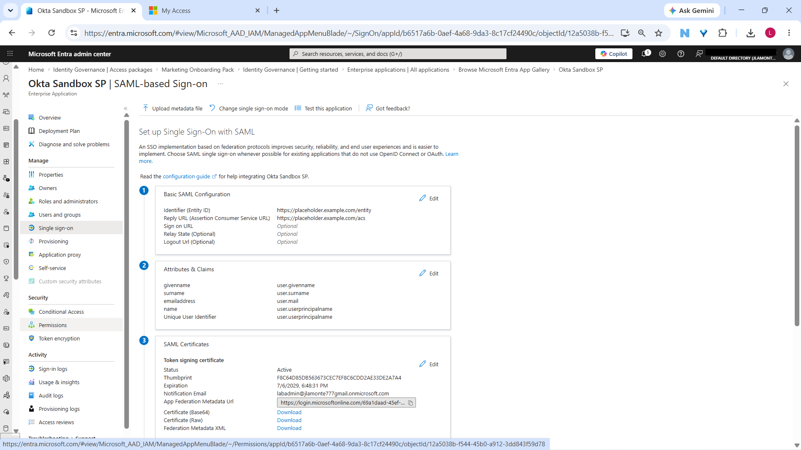

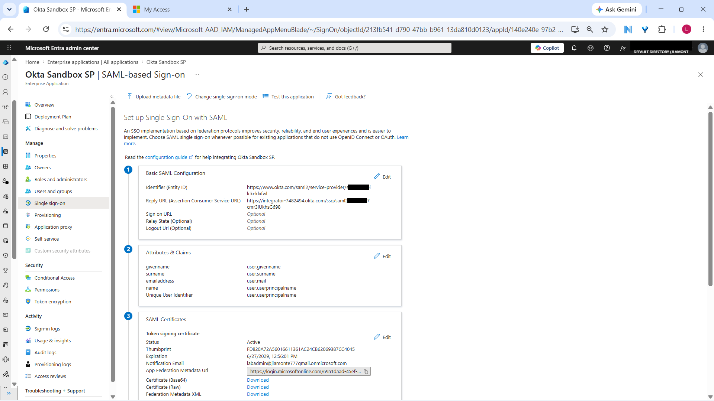
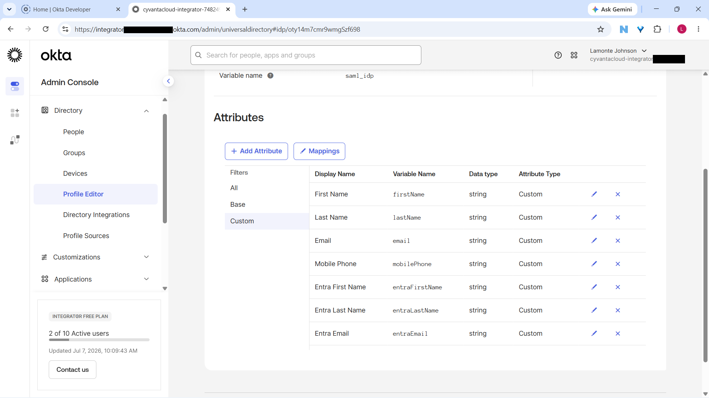
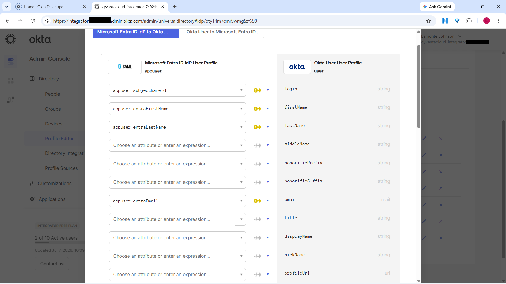
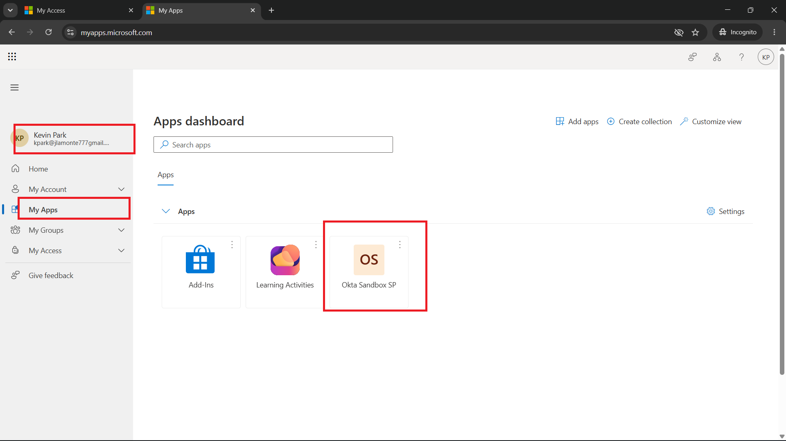
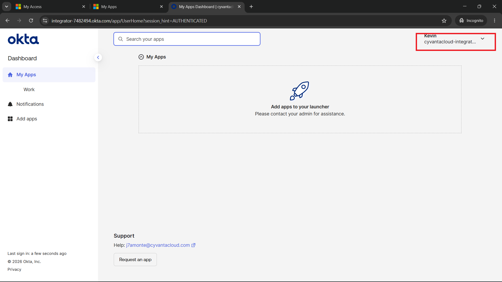
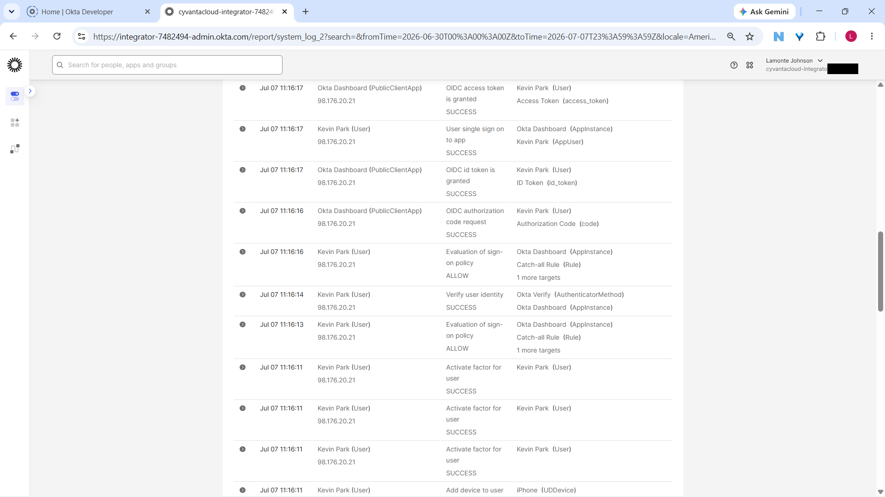

## 7. Lab 4: Automated Access Certification & Risk-Based Identity Protection

### Phase 1: Entra ID Access Reviews (Governance & Attestation)

**Business Problem:** Even with Access Packages and PIM in place, identities inevitably accumulate nested or stale permissions over time. Managers forget to revoke access when projects end, and manual processes fail compliance audits. A self-remediating certification campaign forces resource owners to explicitly re-attest whether users still require high-privilege access — and automatically removes access when they don't respond.

**Solution:** Deployed an automated access review campaign (REV-Finance-Quarterly-Attestation) targeting GRP-Finance-HighSecurity. Configured the reviewer as the Lab Admin account, set a 14-day review window with a one-time recurrence, and enabled the "no sign-in within 30 days" decision helper to surface stale accounts automatically. Critically, enabled auto-apply results with a "Remove access" fallback for non-responsive reviewers — enforcing a deny-by-default stance without requiring manual intervention.

**Verification Result:** Logged in as the auditor, approved one Finance user (Linda Chen — "Required for core quarterly ledger operations") and denied another (David Cho — "Project concluded; baseline access no longer required"). Manually stopped the review early to trigger the auto-remediation engine. Confirmed the denied user was automatically removed from GRP-Finance-HighSecurity by the Azure AD Identity Governance service actor — not by an admin — as evidenced in the group's audit log.

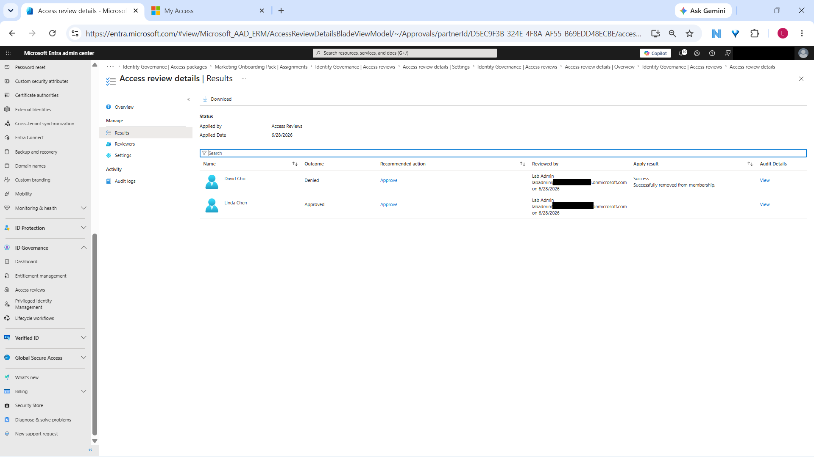
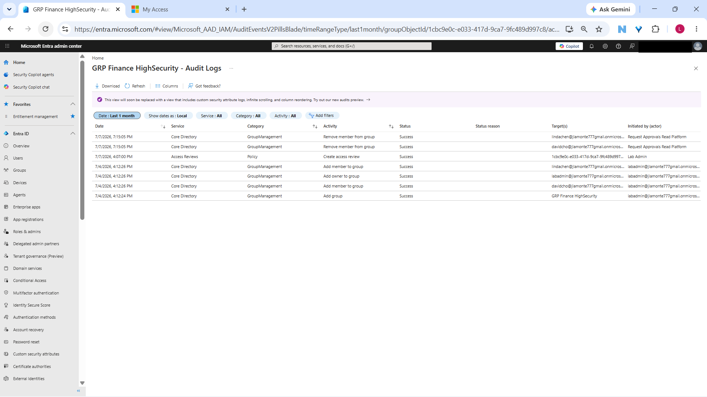

### Phase 2: Risk-Based Conditional Access (Machine Learning Defense Perimeter)

**Business Problem:** Static access rules fail when attackers use stolen credentials from a new location, or when legitimate users exhibit anomalous behavior. A dynamic, machine-learning-driven perimeter is needed that evaluates the behavioral risk of every authentication attempt in real time before granting access.

**Solution:** Built CA-Finance-RiskBased-DynamicMFA — a Conditional Access policy targeting GRP-Finance-HighSecurity across all cloud resources, triggering a mandatory MFA challenge whenever Microsoft's Identity Protection engine assigns a Medium or High risk score to a sign-in attempt. Risk signals evaluated include impossible travel, anonymous IP addresses, unfamiliar sign-in properties, and leaked credential detections.

**Change Management Implementation:** Following enterprise deployment best practices, staged the policy in Report-only mode first to validate scope and evaluate expected behavioral impact without enforcing controls. After confirming the policy evaluated correctly, promoted it to On. This two-stage deployment lifecycle demonstrates mature change management — the same process used in enterprise environments to prevent accidental lockouts.

**Safety Architecture:** Explicitly excluded the Emergency Break-Glass account from the policy scope. If an attacker triggers a high-risk event that locks down the environment, the emergency recovery path remains unblocked regardless of sign-in risk score.

**Evidence:** Screenshots captured showing the policy in Report-only state, then promoted to On, plus the Sign-in risk detections dashboard confirming the monitoring feed is active. Note: the sandbox environment does not generate real-world risk signals such as impossible travel or leaked credential detections, so the detections dashboard showed a clean baseline state — which is the expected outcome in a lab tenant.
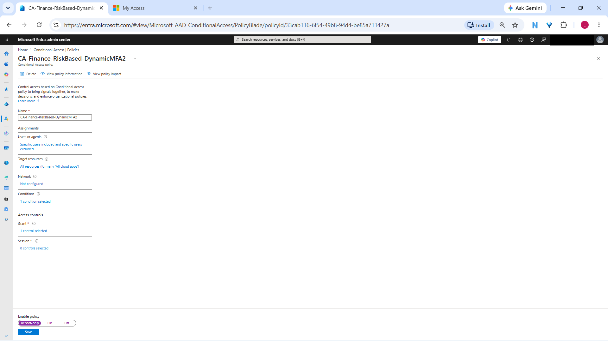
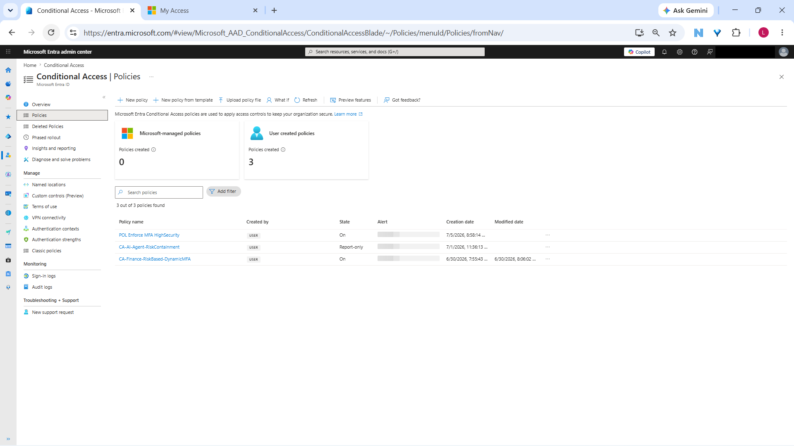
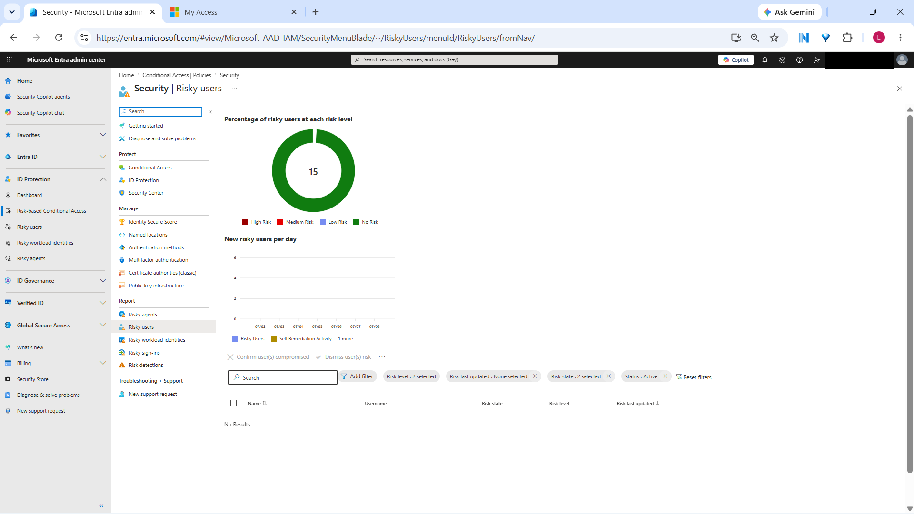

## 8. Lab 5: Microsoft Entra Agent ID — AI Workload Identity Governance

**Business Problem:** As organizations deploy autonomous AI agents alongside human workers, the same identity governance principles that protect human accounts must extend to non-human workloads. An AI agent with ungoverned access represents a new attack surface — if compromised or behaving anomalously, it can exfiltrate data or escalate privileges without any human authentication event to trigger traditional security controls.

**Context:** Microsoft Entra Agent ID became generally available in 2026, making this one of the most current IAM capabilities available. Building hands-on lab evidence of AI workload identity governance demonstrates awareness of the emerging frontier of enterprise identity security — a differentiator that most entry-level candidates cannot speak to.

**Solution:** Provisioned a governed AI workload identity using Microsoft's Agent ID framework, applied a risk-based Conditional Access policy scoped specifically to the agent identity, and deployed monitoring infrastructure to track agent sign-in behavior separately from human user activity.

**Agent Identity Blueprint:**
Created BLU-Finance-CustomerSupportBot as the parent governance template. Assigning labadmin as both Owner (administrative control) and Sponsor (human accountability for incident response) satisfies enterprise AI governance requirements mandating that every autonomous agent have a designated human responsible for its lifecycle and behavior.

Upon blueprint creation, Entra ID automatically provisioned two objects simultaneously — the Agent Identity Blueprint and its underlying Blueprint Principal — confirming the framework was correctly initialized.

**Conditional Access Policy (CA-AI-Agent-RiskContainment):**
Built a Conditional Access policy targeting the specific agent identity rather than all agents globally. Key configuration decisions:

- **Scope:** Select agent identities → BLU-Finance-CustomerSupportBot (precise targeting rather than a blanket all-agents policy)
- **Target resources:** All agent resources (scoped to agent-specific resource flows, architecturally separated from human user cloud app policies)
- **Condition:** Agent risk (Preview) — High and Medium risk levels (ML-driven signal that fires when Identity Protection detects the agent may be compromised)
- **Grant:** Block access (default-deny posture for an AI workload with no currently authorized resource access)
- **Deployment:** Report-only mode, consistent with enterprise change management discipline applied throughout this lab series

**Why risk-based rather than blanket block:** Configuring Agent risk conditions rather than unconditionally blocking access demonstrates understanding of adaptive security architecture — In an enforced deployment, the agent could operate normally until Microsoft's Identity Protection ML engine detects anomalous behavior patterns, at which point access would be automatically blocked. This mirrors the same Zero Trust-aligned, signal-driven approach used for human identities in Lab 4.

**Evidence:** Screenshots captured showing the Agent blueprints dashboard, Linked agent identities confirming the provisioned agent identity, the Conditional Access assignments panel showing "Users or agents → Agents" with agent-specific targeting options (All agent identities, All agent users, Select agent identities, Select agent users), Agent risk (Preview) condition configured with High and Medium selected, and the final Conditional Access policies dashboard showing all three user-created policies with their respective states (CA-AI-Agent-RiskContainment: Report-only, CA-Finance-RiskBased-DynamicMFA: On, POL-Enforce-MFA-HighSecurity: On).
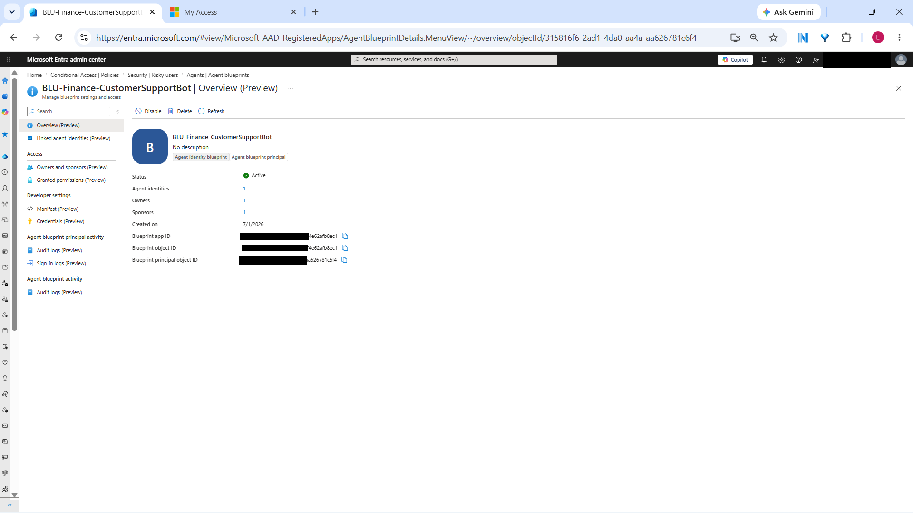
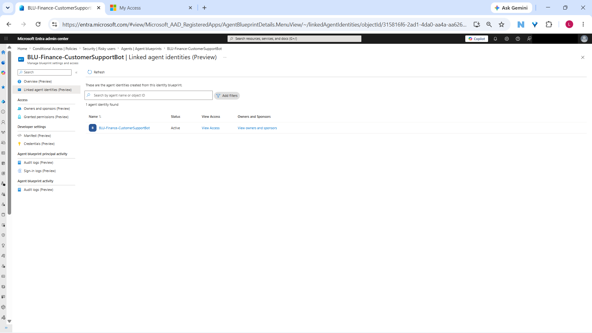
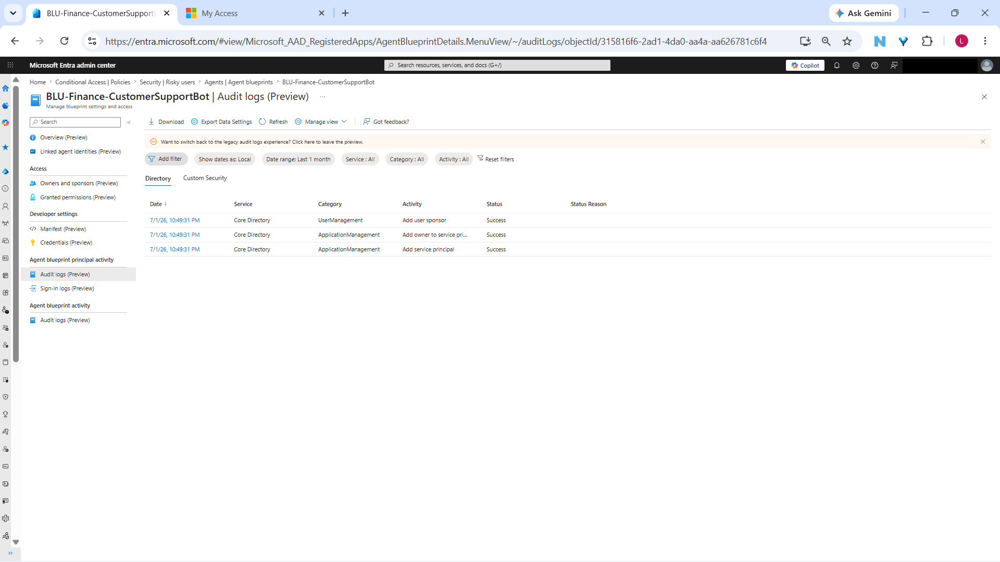
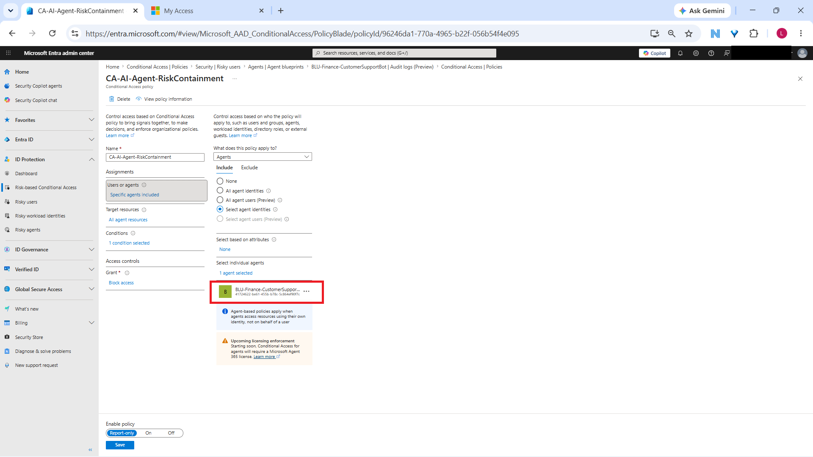
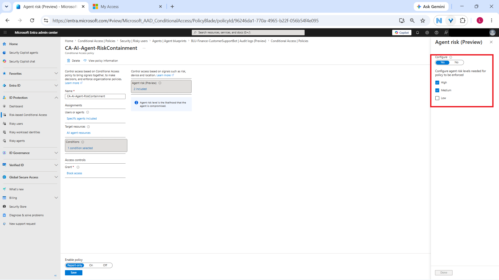
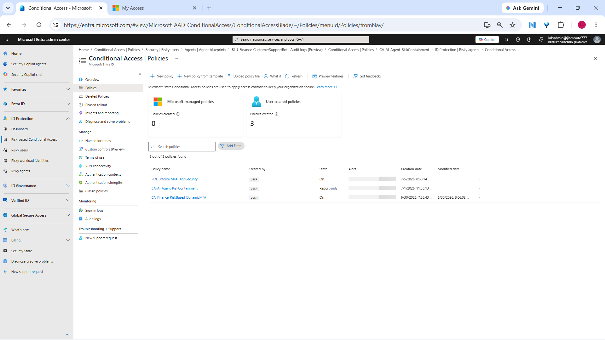
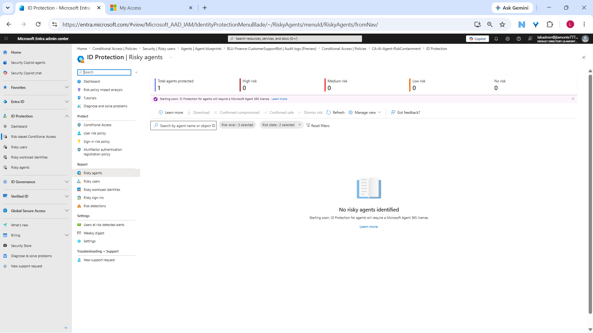

**Licensing note:** The lab tenant exposed Agent ID and agent-risk Conditional Access capabilities during testing. Microsoft's Agent 365 and Entra Agent ID licensing model is evolving, and future production deployments may require Microsoft Agent 365 licensing depending on the agent governance capabilities used — documented here as a real-world constraint awareness finding consistent with production deployment planning.

## 9. Key Technical Takeaways

- Implemented and validated the complete Joiner-Mover-Leaver identity lifecycle, including proactive privilege creep remediation during role transitions
- Converted standing/permanent administrative access into Just-In-Time privileged access via Microsoft Entra PIM, enforcing time-bound activation windows, mandatory MFA step-up, and auditable business justification on every elevation request
- Deployed an automated access certification campaign using Entra ID Access Reviews, configuring deny-by-default auto-remediation that removed a user from a high-security group via the Azure AD Identity Governance service actor rather than manual admin action
- Built and deployed a governed AI workload identity using Microsoft Entra Agent ID (generally available 2026), provisioning an agent identity blueprint with designated human ownership and sponsorship, and applying a risk-based Conditional Access policy targeting the specific agent identity using Agent risk (Preview) ML conditions — extending Zero Trust principles to non-human AI workloads
- Built and debugged a live cross-platform SAML 2.0 federation bridge between Microsoft Entra ID (IdP) and Okta (SP), diagnosing a real XML schema attribute mismatch via system log analysis and resolving it through custom directory schema mapping
- Unified external SaaS access under the same governance lifecycle as internal resources, binding a federated application directly into an Entitlement Management access package rather than provisioning SSO as a standalone exception
- Designed and enforced Zero Trust Conditional Access policies with risk-based MFA targeting
- Delegated administrative functions using least-privilege RBAC, verified through dual-sided permission boundary testing
- Engineered a monitored break-glass emergency access account, balancing availability requirements against security exposure
- Authored and executed KQL queries against live SIEM telemetry, including custom result-code translation logic
- Identified and documented a real-world architectural constraint observed in this lab tenant (Microsoft tenant-level security defaults overriding custom Conditional Access exclusions in some cases) not commonly covered in introductory material

## 10. Portfolio Evidence Captured

- Entra ID user directory with populated test identities across departmental archetypes
- Dynamic group membership rule and resulting auto-populated membership
- Conditional Access policy targeting a high-security user group
- MFA challenge screen during test login
- Helpdesk Administrator role assignment and access-denied validation against Conditional Access
- JML lifecycle screenshots for the Joiner, Mover, and Leaver stages
- Audit log evidence for account disablement (AccountEnabled true → false)
- Log Analytics KQL query and break-glass account sign-in telemetry
- PIM eligible assignment configuration and live activation countdown proof
- Access Package configuration (catalog, resources, approval policy, expiration) and assignment result
- Entra ID SAML configuration for the Okta Sandbox SP application
- Okta inbound SAML Identity Provider configuration
- Okta System Log error trace and custom schema mapping resolution
- Access Review configuration for REV-Finance-Quarterly-Attestation showing target group, reviewer, duration, auto-apply, and deny-by-default fallback settings
- Reviewer decision screen showing one approved and one denied user with written justifications visible
- Group audit log showing Azure AD Identity Governance as the actor removing the denied user from GRP-Finance-HighSecurity
- Risk-based Conditional Access policy CA-Finance-RiskBased-DynamicMFA shown in Report-only mode
- Risk-based Conditional Access policy promoted to On with break-glass exclusion confirmed
- Agent blueprints dashboard showing BLU-Finance-CustomerSupportBot created with Active status, Owner, Sponsor, and both Blueprint app ID and Principal object ID populated
- Linked agent identities screen confirming auto-provisioned agent identity
- Conditional Access assignments panel showing Agents-specific targeting options including All agent identities, Select agent identities, and Agent risk condition
- Agent risk (Preview) condition configured with High and Medium risk levels selected
- Conditional Access policies dashboard showing all three user-created policies with states (CA-AI-Agent-RiskContainment: Report-only, CA-Finance-RiskBased-DynamicMFA: On, POL-Enforce-MFA-HighSecurity: On)
- Successful end-to-end SSO/JIT provisioning result from Microsoft MyApps into Okta
- Practiced cloud cost governance by decommissioning monitoring infrastructure after validation was complete
